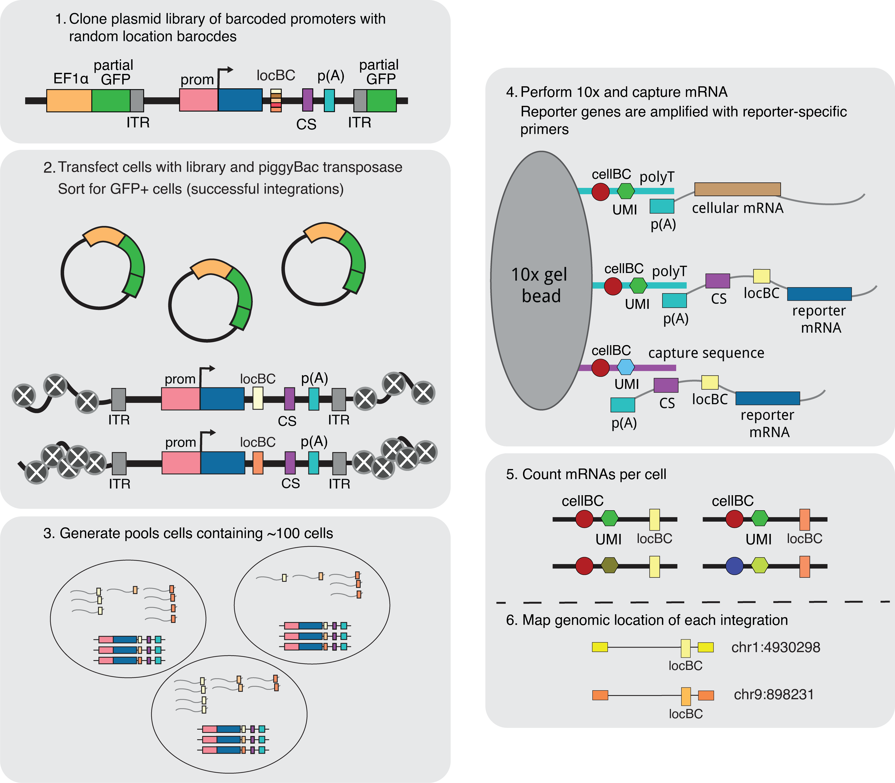

# castools
Command line tools and analysis code for the SARGENT project.

# Authors
Clarice, Avi and Siqi from the Barak Cohen Lab

# Code structure
The code has been organized into a series of folders described below.

## figures
This folder contains code and data for making the figures in the pre-print.

## analysis-code
This folder contains notebooks and scripts used for analysing the data from a SARGENT run. Files
related to classifying genomic locations into high-MIN vs low-MIN and high-mean vs low-MIN are
included in the classifier/ subfolder.

## castools
This folder contains a command-line tool for processing the raw data from a SARGENT experiment.

# Citation
The experimental methods and analysis results are described in this preprint:
https://www.biorxiv.org/content/10.1101/2022.08.31.506082v1
